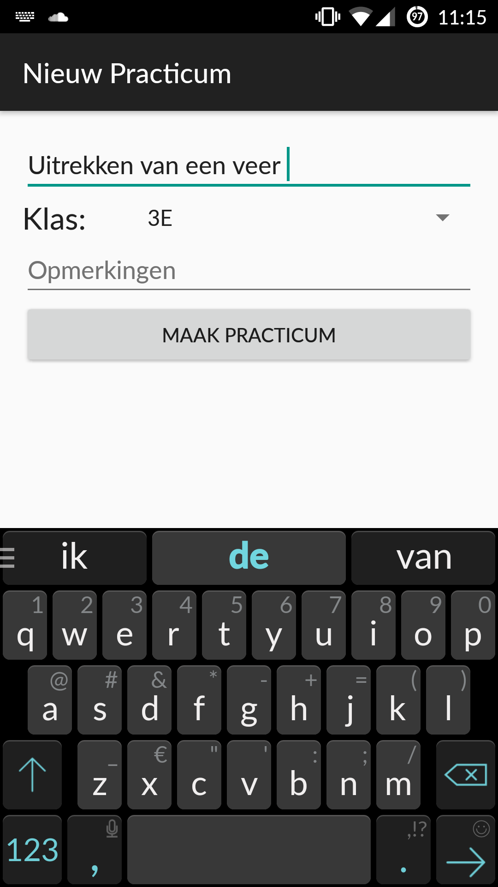

# Design document

In het readme bestand staat omschreven hoe de app er uit moet komen te zien. Nu dat bekend is, is het tijd om te kijken naar hoe dit daadwerkelijk geïmplementeerd gaat worden. Dat zal beschreven worden in dit document, het 'design document'.

## Activities
In het readme bestand zie je hoe je van scherm naar scherm kunt navigeren. Dat wil zeggen: welke knoppen je moet indrukken/handelingen je moet verrichten om van het ene naar het andere scherm te komen. Deze schermen (in android taal: 'activities') zijn echter niet altijd uniek. Soms kun je op verschillende manieren bij dezelfde of heel vergelijkbare activities komen. In afbeelding 1 is te zien hoe er tussen de activities genavigeerd kan worden. De zwartomrande blokken zijn activities, de gekleurde pijlen geven aan welke 'paden' je door activities je kunt nemen. Bij de gekleurde lijnen staat ook (in de bijbehorende kleur) waar je op moet drukken om van activity naar activity te gaan. Hierbij geven aanhalingstekens aan dat het om een knop (met die tekst erop) gaat. Onder de afbeelding staat omschreven welke inhoud bij de activities hoort.

*Afbeelding 1, Activity hierarchie.*

- Home: Het hoofdmenu met 5 knoppen.
- NieuwPracticum: Scherm dat je te zien krijgt wanneer je een nieuw practicum wilt maken.
- Practicum: Lijst met klikbare namen van leerlingen.
- Detail: Detailoverzicht van de gebeurtenissen van één leerling tijdens één practicum.
- klassen: Lijst met klassen met een optie om klassen toe te voegen/te verwijderen.
- Practica: Lijst met practica die zijn verricht door de geselecteerde klas/leerling.
- leerlingen: Lijst met leerlingen met een optie om leerlingen toe te voegen/te verwijderen.
- gebeurtenissen: Lijst met de mogelijke gebeurtenissen tijdens de practica (met score). Mogelijkheid om aan te passen/toe te voegen.
- NieuwePeriode: Scherm dat je te zien krijgt als je een nieuwe periode wilt starten.

De namen van de activities zoals ze in de code zullen worden geïmplementeerd, zijn de bovenstaande namen + 'Activity.java'. Dus 'Home' heet in de code 'HomeActivity.java', het bijbehordende layout-bestand zal 'layout_home.xml' heten. Dit naar android standaarden.

## Stijl
Stijl lijkt misschien niet zo'n belangrijk punt, maar het heeft wel degelijk invloed op de code en er kan dus niet vroeg genoeg over nagedacht worden. Ik heb er voor gekozen om 'material design' van android aan te houden (zie https://developer.android.com/design/material/index.html). In dit relatief nieuwe design zit het 'material' thema, welke ik aan zal houden in de app. Omdat sommige elementen uit het thema alleen werken vanaf android API level 21 of hoger, kies ik er voor om android API 21 als 'target' aan te houden. De app zal dus te gebruiken zijn door telefoons vanaf android API 21 (android 5.0 Lollipop). Met deze stijlkeuze komen de Home-, NieuwPracticum- en PracticumActivities er als volgt uit te zien:

<kbd>
  
</kbd>
<kbd>

</kbd>
<kbd>

</kbd>
<kbd>

</kbd>
*Afbeelding 2a, 2b, 2c, 2d, Uiterlijk van drie activities (HomeActivity, NieuwPracticumActivity en PracticumActivity).*

De kleuren kunnen binnen dit thema heel makkelijk aangepast worden (in een resource file), wat betekent dat daar nog geen keuze in gemaakt hoeft te worden. Dat het gaat veranderen staat wel al vast, dit zwarte is naar mijn mening te zakelijk/saai.

## Data opslag
Het opslaan van alle gebeurtenissen is de belangrijkste functie van de app. Het is dan ook zaak dat dit op een goede en veilige manier gebeurt. De datastructuur is niet ingewikkeld, een tabel is voldoende per klas per periode. De kolommen ('x') van de tabel staan dan voor leerlingen, de rijen ('y') voor practica en de velden worden gevuld met de gebeurtenissen van leerling x tijden practicum y. Zie afbeelding 3 voor een voorbeeld van zo'n tabel.

Voor het daadwerkelijk opslaan van de data zal gebruik gemaakt worden van SQLite. Dit relationele database management system zit standaard in android ingebakken. Met SQLite kan de app vrij gemakkelijk alle data en de onderlinge relaties daartussen kwijt in één bestand dat op het apparaat blijft staan, zelfs als het wordt uitgeschakeld.

## Data output
Het zou zonde zijn als alle gedocumenteerde gebeurtenissen alleen op de telefoon blijven staan, zonder dat er iets mee gebeurt. Want naast het documenteren van gebeurtenissen en toekennen van score aan leerlingen, is het ook wenselijk dat de leerlingen hier iets van terugzien, zodat ze zelf weten wat goed gaat/wat beter kan. Er moet dus een manier komen om de data op de pc te krijgen, waarna het bewerkt en uitgeprint/digitaal uitgereikt kan worden. Door de vorm van de data (tabellen per klas per periode), ligt een spreadheet voor de hand. Het gebruik van Google sheets heeft als voordeel dat de sheets automatisch naar de cloud worden gesynchroniseerd (namelijk je google drive). Gelukkig heeft Google sheets een uitgebreide API (https://developers.google.com/sheets/), waardoor bovenstaande plan prima uitgevoerd kan worden. Afhankelijk van de snelheid van het genereren/updaten van een sheet, moet nog worden besloten of dit 'realtime' zal gebeuren (bijvoorbeeld elke keer dat de SQLite database update), of dat er een extra knop in het hoofdmenu komt waarmee de Google sheet geupdate/aangemaakt wordt. Zie afbeelding 3 voor een voorbeeld van zo'n sheet (geopend in Excel).

*Afbeelding 3, Spreadsheet output.*

## Technische details bij het navigeren door de app
In afbeelding 1 van dit document is te zien van welke activities je bij welke activities kunt komen. De afbeelding geeft een redelijk overzicht, maar is niet compleet in termen van wat er gebeurt tussen de verschillende activities. In de onderstaande afbeeldingen (afbeelding 4 t/m 6) wordt ingezoomd op de bovenste drie 'bewandelbare routes' door de app, namelijk het maken van een nieuw practicum, het bekijken van oude practica en het bekijken van leerlingen. De kleuren van de routes (oranje, blauw en groen) komen overeen met de kleuren in afbeelding 1, zodat het goed te zien is hoe de routes zich verhouden in het grotere geheel. 

### Nieuw practicum
Wil je een nieuw practicum aanmaken, dan druk je op de eerste knop op het hoofdmenu: "Nieuw practicum". Het brengt je naar NieuwPracticumActivity.java (zie afbeelding 4 en afbeelding 2a), alwaar je het practicum een naam moet geven en de klas moet instellen. Eventueel kun je nog een opmerking toevoegen. Nadat je klas en naam hebt ingevuld, wordt de knop "Maak practicum" bruikbaar gemaakt (daarvoor was het disabled) (zie afbeelding 2b, 2c). Bij het drukken op de knop gebeuren er een aantal dingen achter de schermen. PracticumActivity.java wordt geopend, de data (naam, klas en opmerking) wordt doorgestuurd als extra van het intent naar die activity, en in de activity zelf wordt voor het eerst iets met de database gedaan. Tijdens het 'maken' van PracticumActivity.java (onCreate) wordt eerst gekeken of er al een database bestand is voor deze klas in deze periode, zo ja, dan wordt het practicum er aan toegevoed, zo nee, dan wordt het aangemaakt en wordt het practicum er aan toegevoegd. Dit toevoegen gebeurt op de eerste vrije rij in de database, voorzien van huidige datum en tijd. Daarna zal de app wachten totdat de gebruiker op een naam drukt. Gebeurt dit, dan opent er een popup window, met een aantal knoppen voor een aantal gebeurtenissen. Bij het drukken op een van deze knoppen, sluit de popup window zich en wordt de gebeurtenis toegevoegd aan de database. Ook PracticumActivity.java wordt geupdate, omdat de gebeurtenis dan in het klein onder de naam kan verschijnen, zodat je als gebruiker weet dat je de goede handeling hebt verricht. Vanuit de popup window kun je nog twee andere dingen doen. Als je op de fysieke 'back' knop drukt van je telefoon, kom je weer terug in PracticumActivity.java zonder dat er iets achter de schermen gebeurt (geen database handelingen). Druk je op het kleine, half weggestopte 'details' knopje, dan kom je terecht in DetailsActivity.java. Hier zien kunnen we de naam van de leerling aanpassen, gebeurtenissen van het huidige practicum bij deze leerling verwijderen en ook de hele leerling verwijderen (nadat de app vraagt om bevestiging, natuurlijk). Al deze handelingen hebben natuurlijk database handelingen tot gevolg, zie afbeelding 4 voor een overzicht.

*Afbeelding 4, Technische details bij het maken van een nieuw practicum.*

### Bekijk practica
De tweede knop van het hoofdmenu, "bekijk practica", leidt naar het pad dat te zien is in afbeelding 5. Het einde ervan (PracticumActivity, DetailsActivity en de popup window) zijn identiek aan het maken van een nieuw practicum (zie afbeelding 4). Het begin is echter anders. Zodra de gebruiker op "bekijk practica" drukt, moet er iets uit de database gehaald worden, namelijk de namen van de klassen die de huidige periode practica gedaan hebben. Deze worden in een lijst op het scherm weergegeven. Drukt de gebruiker op een klas uit de lijst, dan wordt die klas als extra doorgestuurd naar de volgende activity (PracticaActivity, niet te verwaren met PracticumActivity). In deze activity worden voor de zojuist doorgestuurde klas alle gedane practica met datums weergegeven. Deze informatie zal natuurlijk uit de database gehaald moeten worden. Drukt de gebruiker nu op zo'n practicum, dan opent zich PracticumActivity op een vergelijkbare manier als hierboven beschreven, met als enige verschil dat er nu al een database entry bestaat van dit practicum. Nu moeten dus niet alleen de leerlingen, maar ook de de gebeurtenissen bij de leerlingen geladen en weergegeven worden. Er zal een functie gemaakt worden, genaamd "updatePracticum", die dit werk verricht. Deze functie zal worden aangeroepen elke keer als men via de hierboven beschreven manier bij PracticumActivity terecht komt, of wanneer met uit de popup-window op een gebeurtenis drukt. De rest van de 'blauwe route' staat hierboven beschreven, onder het kopje "Nieuw Practicum".

*Afbeelding 5, Technische details bij het bekijken/aanpassen van een oud practicum.*

### Leerlingen
De derde, 'groene' route, laat zien hoe je via een beetje een andere weg op hetzelfde uit kunt komen als in de bovenstaande 'blauwe' route. Deze keer selecteer je niet een practicum om tot een lijst met leerlingen en hun gebeurtenissen te komen, maar selecteer je een leerling om tot een lijst met gedane practica en gebeurtenissen te komen (zie afbeelding 6, vergelijk met afbeelding 5). Voor een docent is deze alternatieve route erg handig, als een specifieke leerling tussentijds om een overzichtje vraagt bijvoorbeeld. In de code heeft de route grote gelijkenis met de blauwe "bekijk practica" route. Het technische verhaal is dan ook hetzelfde, met als enige verschil dat het blauwe PracticaActivity (lijst met practica) nu LeerlingenActivity is (lijst met leerlingen), en dat het blauwe PracticumActivity (lijst met leerlingen + gebeurtenissen) nu PracticaActivity (lijst met practica + gebeurtenissen) is.

*Afbeelding 6, Technische details bij het bekijken/aanpassen van leerlingen.*

### Klassen en leerlingen toevoegen/verwijderen
Over het toevoegen van klassen en leerlingen is nog niks gezegd. Ook staan deze opties niet afgebeeld in afbeelding 4 t/m 6, om de plaatjes niet nog onoverzichtelijker te maken. Het idee is als volgt: in KlassenActivity (lijst met klassen) en LeerlingenActivity (lijst met Leerlingen) komt rechtsonderin een zogeheten 'floating action button'. Dit kleine ronde knopje (zie afbeelding 7) zorgt er voor dat er een knopje achter elk item in de lijst komt, om dat item te verwijderen (dus een klas of een leerling). Natuurlijk vraagt de app nog wel even om te bevestigen, omdat er data wordt verwijderd. Ook komt er onderin het scherm een optie om een item (dus klas of leerling) toe te voegen. Al deze handelingen hebben natuurlijk gevolgen voor de database, die moeten netjes verwerkt worden. Het is nog maar even de vraag of dit idee, dus het verschijnen van de toevoeg/verwijder opties, handig in dezelfde acitivity kan, of dat het makkelijker is om een compleet nieuwe activity te openen waar die knoppen al in zitten. Wat meer onderzoek op dit gebied is nodig.

*Afbeelding 7, LeerlingenActivity met 'floating action button'.*

